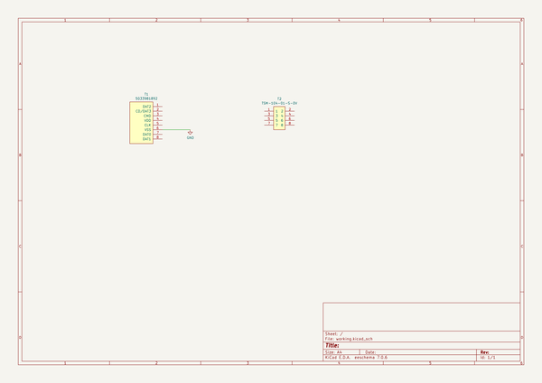
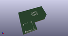
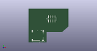

# OOMP Project  
## SD2SP2-USA  by adamjvr  
  
oomp key: oomp_projects_flat_adamjvr_sd2sp2_usa  
(snippet of original readme)  
  
- SD2SP2-USA  
  
Implementation of side accessible SD2SP2 for gamecube made in the USA  
  
  full source readme at [readme_src.md](readme_src.md)  
  
source repo at: [https://github.com/adamjvr/SD2SP2-USA](https://github.com/adamjvr/SD2SP2-USA)  
## Board  
  
  
## Schematic  
  
  
  
[schematic pdf](working_schematic.pdf)  
## Images  
  
  
  
  
  
  
