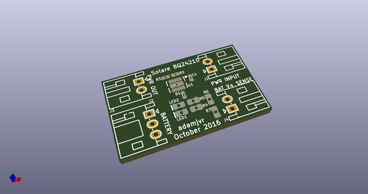
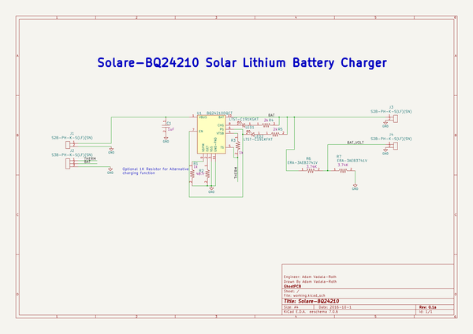
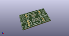
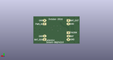
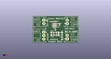

# OOMP Project  
## Solare-BQ24210  by adamjvr  
  
(snippet of original readme)  
  
- Solare-BQ24210  
Solare-BQ24210 is a solar Lithium Battery charger based on the BQ24210 battery charge controller from Ti  
  
Solare-BQ24210 PCB  
  
  
  
KiCAD 3D Render  
  
  
OSHPark Render  
  
  
OSHPark PCBs 10/19/2016  
  
  
  
  full source readme at [readme_src.md](readme_src.md)  
  
source repo at: [https://github.com/adamjvr/Solare-BQ24210](https://github.com/adamjvr/Solare-BQ24210)  
## Board  
  
  
## Schematic  
  
  
  
[schematic pdf](working_schematic.pdf)  
## Images  
  
  
  
  
  
  
