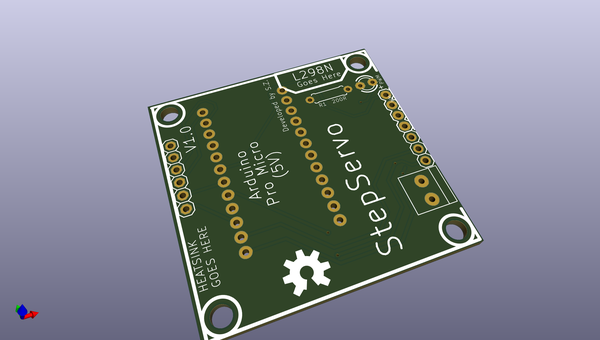
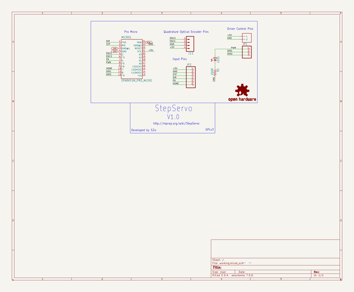

# OOMP Project  
## StepServo  by adamjvr  
  
(snippet of original readme)  
  
- StepServo  
  
Check out the wiki here: http://reprap.org/wiki/StepServo (under construction)  
  
A single channel step/direction/enable/endstop to DC quadrature encoder converter for use with 3D printers or CNC machines. So, basically, a single channel version of my other board, RAMPSSB (https://github.com/SZiv/RAMPSSB), and many of the rules that apply there, apply here. The firmware is identical.  
  
Uses an L298N DC motor driver stacked on standoffs as a driver, and an Arduino Pro Micro as a processor. Designed to need only an arduino Pro Micro, a L298N, some standoffs, an LED, a resistor, a 3mm terminal block, and a bunch of header. Can be assembled easily on your own.  
  
  full source readme at [readme_src.md](readme_src.md)  
  
source repo at: [https://github.com/adamjvr/StepServo](https://github.com/adamjvr/StepServo)  
## Board  
  
  
## Schematic  
  
  
  
[schematic pdf](working_schematic.pdf)  
## Images  
