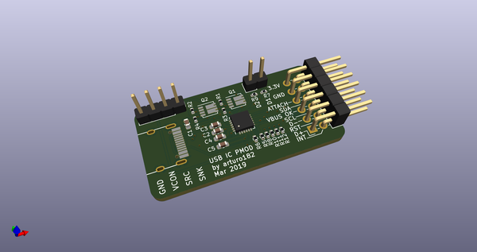
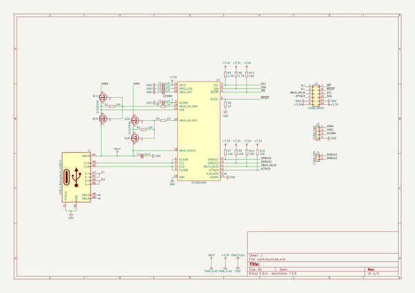
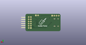
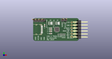

# OOMP Project  
## stusb1600_breakout  by adamjvr  
  
oomp key: oomp_projects_flat_adamjvr_stusb1600_breakout  
(snippet of original readme)  
  
- STUSB1600 USB Type-C Controller Breakout Board  
  
A breakout board for the STUSB1600 USB Type-C controller, with PMOD-ish connector.  
  
  
  
  
  
  
  
  
  full source readme at [readme_src.md](readme_src.md)  
  
source repo at: [https://github.com/adamjvr/stusb1600_breakout](https://github.com/adamjvr/stusb1600_breakout)  
## Board  
  
  
## Schematic  
  
  
  
[schematic pdf](working_schematic.pdf)  
## Images  
  
  
  
  
  
  
