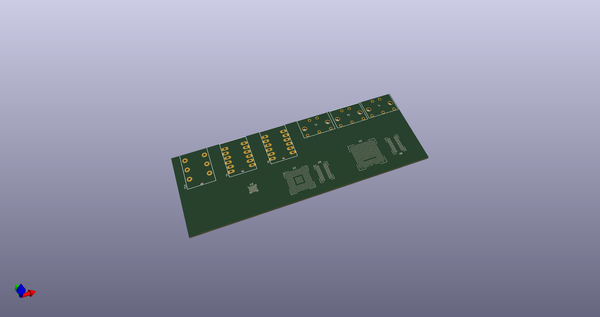
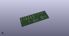
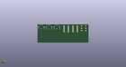
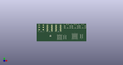

# OOMP Project  
## X0chimilc0  by adamjvr  
  
oomp key: oomp_projects_flat_adamjvr_x0chimilc0  
(snippet of original readme)  
  
- X0chimilc0  
Open source modular synthesizer and DSP platform  
  
X0chimilc0 is designed to be a hardware extension of Axoloti, it intends to  
use the same code base with extensions and backporting as many features as  
possible to the flagship Axoloti board. The main idea behind X0chimilc0 is to  
be nearly the same as Axoloti but with a more powerful MCU and addition of  
an FPGA based hardware sequencer. X0chimilc0 is also focused at being a mother  
board for custom hardware synthesizers. Read more about the Axoloti project  
here:  
http://www.axoloti.com/  
and  
https://github.com/axoloti/axoloti/  
  
Specs:  
- STM32H745XIH6 ARM Cortex M7/M4 Dual Core MCU  
- LFE5U-85F-6BG381C FPGA  
- 1GB DDR3 Memory Each  
- WM8994ECS/R Audio Codec  
- USB-C Connectivity and Powered  
- Standard MIDI IO  
- Stereo Audio Input  
- Stereo Auio Output  
- Headphone Amp Out  
- Onboard MIDI Sequencer up 8 external MIDI Instruments  
- 8x MIDI IO for Additional Instruments  
- 8x CV IO for Additonal Instruments  
  
  full source readme at [readme_src.md](readme_src.md)  
  
source repo at: [https://github.com/adamjvr/X0chimilc0](https://github.com/adamjvr/X0chimilc0)  
## Board  
  
  
## Schematic  
  
  
  
[schematic pdf](working_schematic.pdf)  
## Images  
  
  
  
  
  
  
