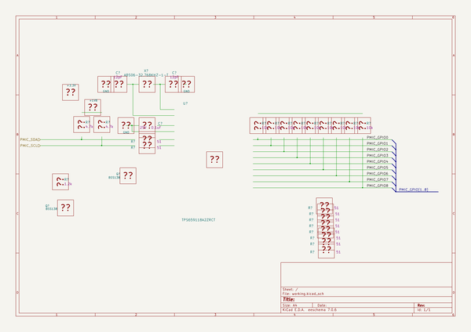

# OOMP Project  
## ZyncMV  by adamjvr  
  
(snippet of original readme)  
  
- ZyncMV  
ZyncMV is an open source machine/computer vision platform using the Xilinx Zync FPGA+ ARM Cortex A9 SoC  
The platform combines hardware acceleration of machine vision in the FPGA fabric with OpenCV running  
on a linux operating system on the ARM Cortex A9 Core.  
  
Specifications:  
- Xilinx XC7Z010-1CLG225C Dual Core ARM Cortex A9 667MHZ + Artix 7 FPGA 28K Cells  
- OV04689-H67A 4K Camera Module  
- Micron DDR3L 512MB (4Gbit)  
- Ti TPS659118A2ZRCT System Power Management Controller  
  
  
Tentative Block Diagram  
  
  
  full source readme at [readme_src.md](readme_src.md)  
  
source repo at: [https://github.com/adamjvr/ZyncMV](https://github.com/adamjvr/ZyncMV)  
## Board  
  
  
## Schematic  
  
  
  
[schematic pdf](working_schematic.pdf)  
## Images  
  
  
  
  
  
  
