# OOMP Project  
## ADA4898_LNA  by aewallin  
  
oomp key: oomp_projects_flat_aewallin_ada4898_lna  
(snippet of original readme)  
  
- ADA4898_LNA  
Low Noise Amplifier based on [ADA4898](https://www.analog.com/en/products/ada4898-1.html).  
Inspired by Gerhard Hoffmann's "lono" design  http://www.hoffmann-hochfrequenz.de/downloads/lono.pdf  
  
-- References  
  
- [LT AN83: "Performance Verification of Low Noise, Low Dropout Regulators"](https://www.analog.com/media/en/technical-documentation/application-notes/an83f.pdf)  
- [AN159 "Measuring 2nV/√Hz Noise and 120dB Supply Rejection on Linear Regulators"](https://www.analog.com/en/app-notes/an-159.html)  
- Leach ["Fundamentals of Low-Noise Analog Circuit Design "](https://leachlegacy.ece.gatech.edu/papers/AnalogNoise.pdf)  
- Wenzel ["A Low Noise Amplifier for Phase Noise Measurements"](http://www.wenzel.com/wp-content/uploads/lowamp.pdf)  
- Rubiola and Lardet-Vieudrin ["Low Flicker-Noise DC Amplifier for 50 Ω Sources"](http://rubiola.org/pdf-articles/conference/2004-fcs-dc-amplifier.pdf)  
- TI ["Source resistance and noise considerations in amplifiers"](https://www.ti.com/lit/an/slyt470/slyt470.pdf)  
  
-- PCB  
100mm x 100mm two-layer PCB.  
  
  
  
  full source readme at [readme_src.md](readme_src.md)  
  
source repo at: [https://github.com/aewallin/ADA4898_LNA](https://github.com/aewallin/ADA4898_LNA)  
## Board  
  
[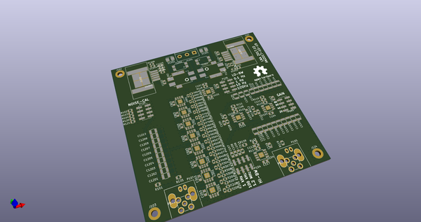](working_3d.png)  
## Schematic  
  
[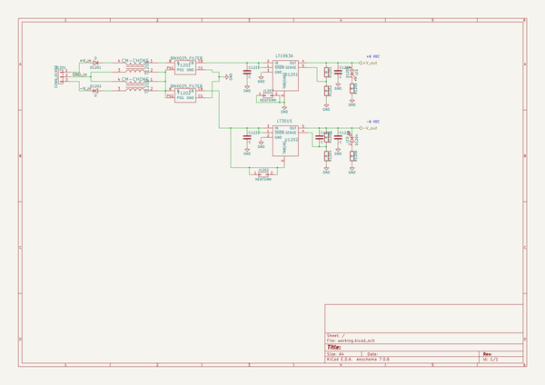](working_schematic.png)  
  
[schematic pdf](working_schematic.pdf)  
## Images  
  
  
  
[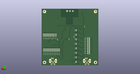](working_3d_back.png)  
  
[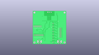](working_3D_bottom.png)  
  
[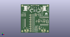](working_3d_front.png)  
  
[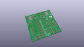](working_3D_top.png)  
  
[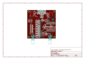](working_assembly_page_01.png)  
  
[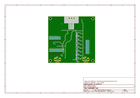](working_assembly_page_02.png)  
  
[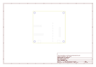](working_assembly_page_03.png)  
  
[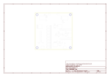](working_assembly_page_04.png)  
  
[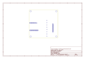](working_assembly_page_05.png)  
  
[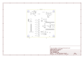](working_assembly_page_06.png)  
