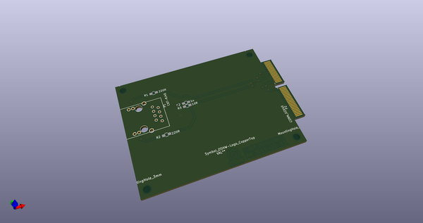
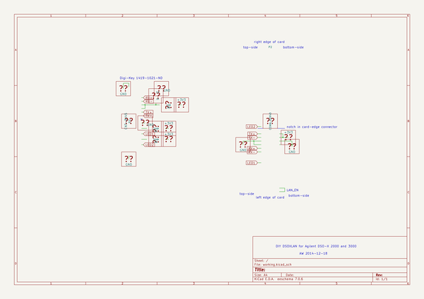
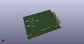
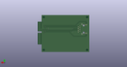
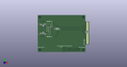

# OOMP Project  
## DSOXLAN  by aewallin  
  
oomp key: oomp_projects_flat_aewallin_dsoxlan  
(snippet of original readme)  
  
DSOXLAN  
=======  
  
This is a simple Ethernet interface-card for Agilent/Keysight  
DSO-X 2000 and 3000 series oscilloscopes. The original Agilent/Keysight   
DSOXLAN module (about 326 euros + VAT as of December 2014)  
also includes VGA output, while this simple card provides only LAN.  
  
Many thanks to "georges80" on the EEVBlog forum  
for the original schematic and PCB layout.  
  
Components:  
* Ethernet jack, Digi-Key nr 1419-1021-ND  
 * Alternative: EDAC A63-113-213N491, Conrad Bestell-Nr.: 1396364-62   
* 2pcs 220R 0805 resistor  
* 1pcs 10R 0805 resistor  
* 1pcs 100n 0805 capacitor  
  
Files:  
* Kicad: schematic, PCB, project, cmp, netlist  
* non-standard footprints in /footprints: Ethernet magjack, 2x40-pin card-edge connector.  
  
Released under the CERN OHL. See http://ohwr.org/cernohl  
  
Links  
=====  
* http://anagram.net/nuts/DSOXLAN/  
* http://www.anderswallin.net/2014/12/diy-dsoxlan/  
  
  full source readme at [readme_src.md](readme_src.md)  
  
source repo at: [https://github.com/aewallin/DSOXLAN](https://github.com/aewallin/DSOXLAN)  
## Board  
  
  
## Schematic  
  
  
  
[schematic pdf](working_schematic.pdf)  
## Images  
  
  
  
  
  
  
