# OOMP Project  
## One-Inch-Photodetector  by aewallin  
  
(snippet of original readme)  
  
- One-Inch-Photodetector  
Photodiode transimpedance amplifier, on a one inch diameter (25 mm) circular 2-sided PCB - for mounting in a  
standard 1" lens-mount.  
  
[TIASim](https://github.com/aewallin/TIASim) can be used to predict gain, noise, and bandwidth using different op-amps,   
transimpedance-gains, etc. Initial results show that capacitive loading on the MMCX connector, when   
connecting a coaxial cable to Spectrum Analyzer or Oscilloscope, plays a role. For un-buffered op-amps TIASim predictions agree   
with measurements when op-amp GBWP is 'de-rated' slightly - probably due to the capacitive load on the output.   
Latest PCB versions use a buffer/cable-driver [BUF602](https://www.ti.com/product/BUF602) to isolate the sensitive transimpedance amplifier   
from output loading.  
  
The board features low-noise LDOs [LT3042](https://www.analog.com/media/en/technical-documentation/data-sheets/3042fb.pdf)   
and [LT3093](https://www.analog.com/media/en/technical-documentation/data-sheets/lt3093.pdf) to produce +V and -V   
DC-rails for the op-amp. The photodiode footprint is TO-18, to fit e.g. Hamamatsu Si photodiodes   
[S5973, S5972, S5973](https://www.hamamatsu.com/resources/pdf/ssd/s5971_etc_kpin1025e.pdf), or Thorlabs   
Si detectors FDS015, FDS025, FD11A, or Thorlabs InGaAs detectors such as FGA01, FGA01FC, FGA015, FDGA05, FD05D, FD10D.  
  
Thorlabs photodiodes seem to match OSI part numbers:  
* Thorlabs FGA01FC, marked INGAAS-120L-FC  
* Thorlabs FDS015, marked FCI-125G-006HR  
* Thorlabs FDS025  
  full source readme at [readme_src.md](readme_src.md)  
  
source repo at: [https://github.com/aewallin/One-Inch-Photodetector](https://github.com/aewallin/One-Inch-Photodetector)  
## Board  
  
  
## Schematic  
  
[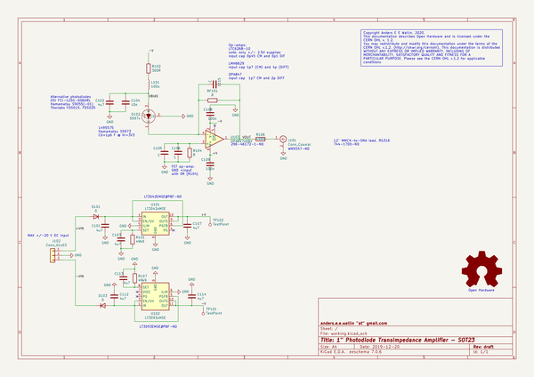](working_schematic.png)  
  
[schematic pdf](working_schematic.pdf)  
## Images  
  
[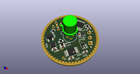](working_3d.png)  
  
[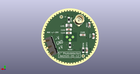](working_3d_back.png)  
  
[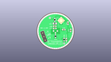](working_3D_bottom.png)  
  
[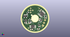](working_3d_front.png)  
  
[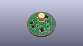](working_3D_top.png)  
  
[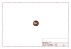](working_assembly_page_01.png)  
  
[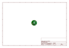](working_assembly_page_02.png)  
  
[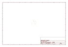](working_assembly_page_03.png)  
  
  
  
[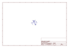](working_assembly_page_05.png)  
  
[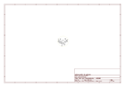](working_assembly_page_06.png)  
