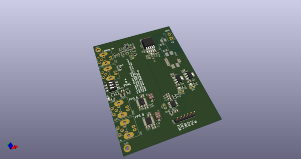
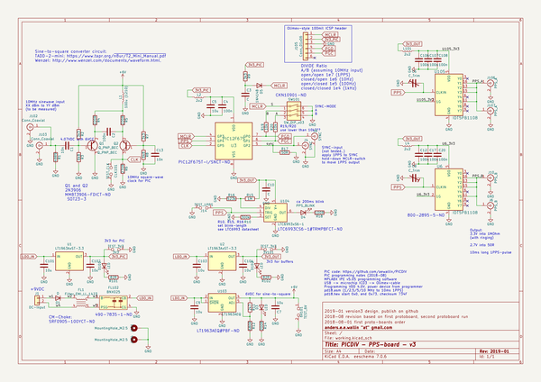
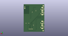
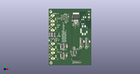

# OOMP Project  
## PICDIV_Board_v3  by aewallin  
  
(snippet of original readme)  
  
- PICDIV_Board_v3  
Programmable 10 MHz to 1PPS frequency divider-board.  
  
The input frequency (sine or square-wave) is first converted to a square-wave and then used as the clock source for a PIC12F675 programmed with the PICDIV firmware (https://github.com/aewallin/PICDIV). Two IDT 5PB1108 buffered outputs are provided. Trimmer-capacitors can be used to accurately tune channel-skew. An LED driven by a timer LTC6993 provides indication of 1PPS signal. A Sync input allows synchronizing the output-1PPS to an input-1PPS, within 100ns (with a 10 MHz clock).  
  
  
  
-- Firmware  
  
- assembler & build-instructions: https://github.com/aewallin/PICDIV  
- original source: http://www.leapsecond.com/pic/picdiv.htm  
  
  full source readme at [readme_src.md](readme_src.md)  
  
source repo at: [https://github.com/aewallin/PICDIV_Board_v3](https://github.com/aewallin/PICDIV_Board_v3)  
## Board  
  
  
## Schematic  
  
  
  
[schematic pdf](working_schematic.pdf)  
## Images  
  
  
  
  
  
  
