# OOMP Project  
## SFP-Breakout-Board  by aewallin  
  
(snippet of original readme)  
  
- SFP-Breakout-Board  
SFP fibre-optical transciever simple breakout board. Works up to at least 1 Gbit/s.  
  
* differential TX+/TX- RX+/RX- outputs/inputs with SMA connectors  
* connector and cage for SFP or SFP+ transciever  
* +3V3 power for transciever  
* Three status LEDs for TX_FAULT, LOS, and MOD_ABS  
* jumpers for SFP rate-select settings.  
  
  
  
  
  
  
  
Spectrum analyzer measurement of tracking-generator output to Tx-board with SFP, short 2 m fiber, and RX-output of receiving board with SFP. Bandwidth up to ca 1.8 GHz.  
  
See also these other similar projects:  
  
* https://github.com/aewallin/SFP2SMA_2018.03  single-ended input/output, with op-amp and transformer coupling to SFP  
* https://osmocom.org/projects/misc-hardware/wiki/Sfp-experimenter  
* https://osmocom.org/projects/misc-hardware/wiki/Sfp-breakout  
* Multi-SFP crate https://www.ohwr.org/project/sfp-plus-i2c/wikis/home  
  
  full source readme at [readme_src.md](readme_src.md)  
  
source repo at: [https://github.com/aewallin/SFP-Breakout-Board](https://github.com/aewallin/SFP-Breakout-Board)  
## Board  
  
[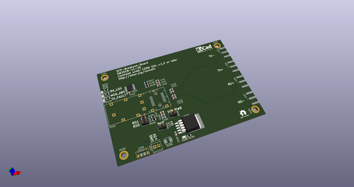](working_3d.png)  
## Schematic  
  
[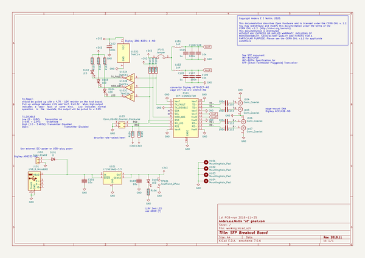](working_schematic.png)  
  
[schematic pdf](working_schematic.pdf)  
## Images  
  
[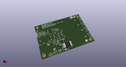](working_3d.png)  
  
[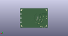](working_3d_back.png)  
  
  
  
[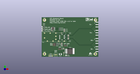](working_3d_front.png)  
  
[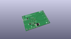](working_3D_top.png)  
  
[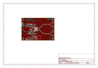](working_assembly_page_01.png)  
  
[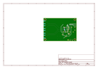](working_assembly_page_02.png)  
  
[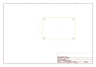](working_assembly_page_03.png)  
  
[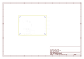](working_assembly_page_04.png)  
  
[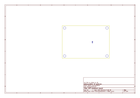](working_assembly_page_05.png)  
  
[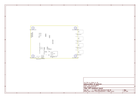](working_assembly_page_06.png)  
