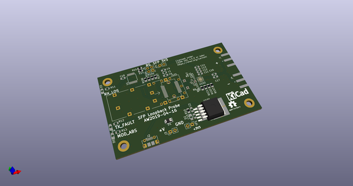
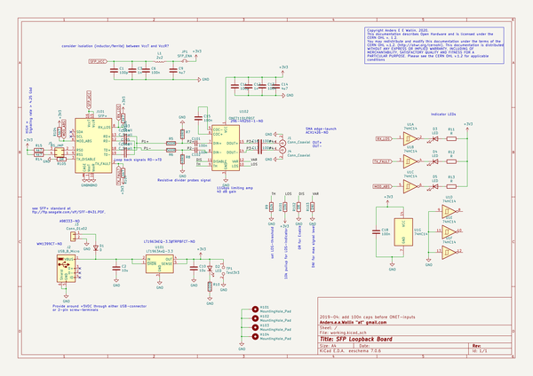
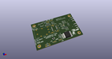
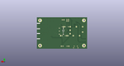
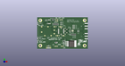

# OOMP Project  
## SFP-Loopback-Board  by aewallin  
  
oomp key: oomp_projects_flat_aewallin_sfp_loopback_board  
(snippet of original readme)  
  
- SFP-Loopback-Board  
SFP optical transciever loopback board. Connects SFP TX pins to RX pins, and provides buffered ( [ONET1191](http://www.ti.com/product/ONET1191P) )probe-outputs on SMA connectors.  
  
See also [SFP+ timing calibration module](https://ohwr.org/project/wr-calibration/wikis/Electrical-absolute-calibration)  
  
  
  
  full source readme at [readme_src.md](readme_src.md)  
  
source repo at: [https://github.com/aewallin/SFP-Loopback-Board](https://github.com/aewallin/SFP-Loopback-Board)  
## Board  
  
  
## Schematic  
  
  
  
[schematic pdf](working_schematic.pdf)  
## Images  
  
  
  
  
  
  
