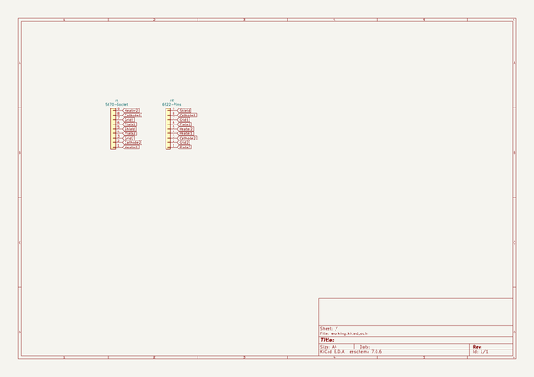
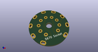
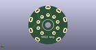
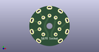

# OOMP Project  
## 5670-6922-adapter  by ai03-2725  
  
oomp key: oomp_projects_flat_ai03_2725_5670_6922_adapter  
(snippet of original readme)  
  
- 5670-6922-adapter  
A simple tube conversion adapter  
  
--- Usage  
  
* 5670 tube on top    
* 6922 amp side    
  
--- Parts  
  
* 1x this PCB    
* 8x 1.016mm or similar diameter pins    
* 1x GZC9 style socket    
  full source readme at [readme_src.md](readme_src.md)  
  
source repo at: [https://github.com/ai03-2725/5670-6922-adapter](https://github.com/ai03-2725/5670-6922-adapter)  
## Board  
  
  
## Schematic  
  
  
  
[schematic pdf](working_schematic.pdf)  
## Images  
  
  
  
  
  
  
