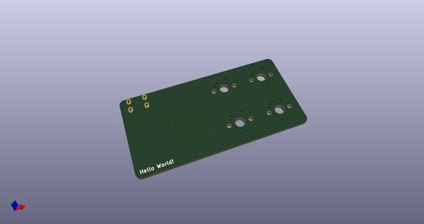
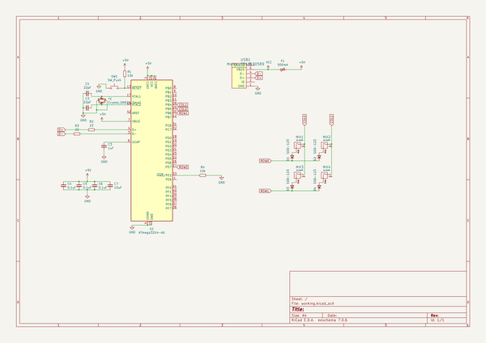
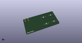
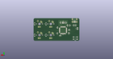
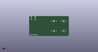

# OOMP Project  
## ai03-keyboard-pcb-guide  by ai03-2725  
  
(snippet of original readme)  
  
- ai03's Keyboard PCB guide  
  
* The guide covers everything from installing KiCad to producing the PCB.  
* [Read it here](https://kbwiki.ai03.me/books/pcb-design/chapter/pcb-designer-guide)  
  
--- Repo contents  
The repository contains the latest version of a PCB built following the guide.  
Feel free to take a look if you need some help.  
  
  full source readme at [readme_src.md](readme_src.md)  
  
source repo at: [https://github.com/ai03-2725/ai03-keyboard-pcb-guide](https://github.com/ai03-2725/ai03-keyboard-pcb-guide)  
## Board  
  
  
## Schematic  
  
  
  
[schematic pdf](working_schematic.pdf)  
## Images  
  
  
  
  
  
  
