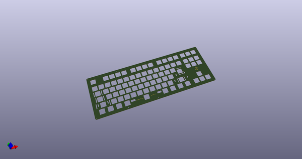
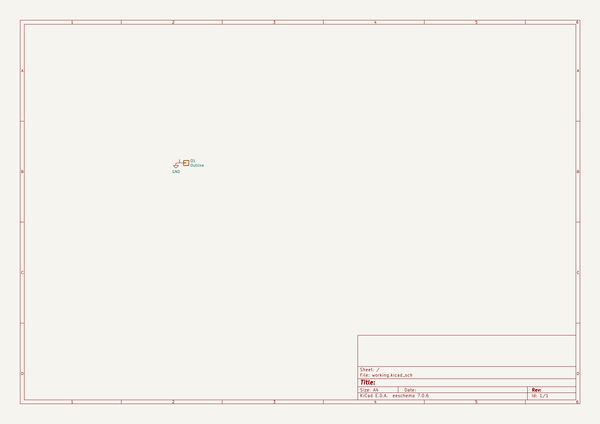
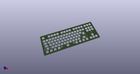
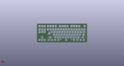
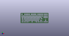

# OOMP Project  
## Celestine  by ai03-2725  
  
oomp key: oomp_projects_flat_ai03_2725_celestine  
(snippet of original readme)  
  
- Celestine  
A Hi-Tek 725 TKL PCB  
  
---- In light of recent claims that I am 100% liable for any of my open source PCBs, I am adding this disclaimer.  
---- I provide these PCBs as a reference for designing keyboard PCBs. Using them within your projects will require a will to do research of one's own and to learn the workings of them, potentially fixing issues if they exist.  
- I provide these PCBs without liability and without any guarantees regarding functionality, as expressed in the MIT license under which all of these PCBs are licensed.  
  
This project aims to revive the use of NMB/Hi-Tek 725 series switches, commonly known as "Space Invaders".  
  
Massive credits go to Engicoder, mcmaxmcmc, and many others for helping me along the way with measurements of existing boards and switches.  
  full source readme at [readme_src.md](readme_src.md)  
  
source repo at: [https://github.com/ai03-2725/Celestine](https://github.com/ai03-2725/Celestine)  
## Board  
  
  
## Schematic  
  
  
  
[schematic pdf](working_schematic.pdf)  
## Images  
  
  
  
  
  
  
