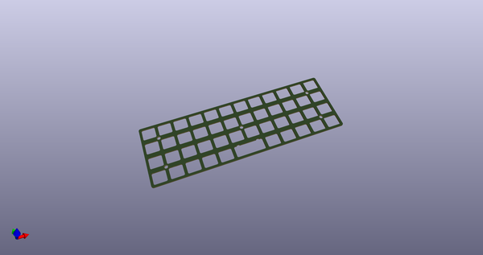
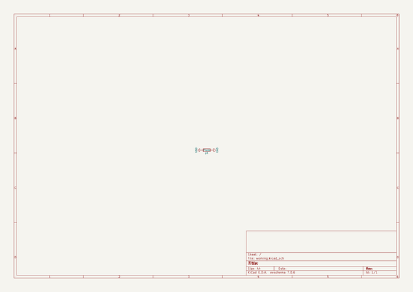
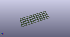
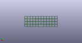
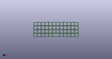

# OOMP Project  
## ContraPlates  by ai03-2725  
  
(snippet of original readme)  
  
- Contra Case Files  
A low cost case for Contra  
  
---- In light of recent claims that I am 100% liable for any of my open source PCBs, I am adding this disclaimer.  
---- I provide these PCBs as a reference for designing keyboard PCBs. Using them within your projects will require a will to do research of one's own and to learn the workings of them, potentially fixing issues if they exist.  
- I provide these PCBs without liability and without any guarantees regarding functionality, as expressed in the MIT license under which all of these PCBs are licensed.  
  
--- Features  
- Alps or MX switches compatibility.  
- Supports split or unified spacebar.  
  
--- Files for production  
- Main PCB: Check the PCB repo [here](https://github.com/ai03-2725/Contra).  
- Case files: Grab the latest gerber files [here](https://github.com/ai03-2725/ContraPlates/tree/master/Production%20Files).  
  full source readme at [readme_src.md](readme_src.md)  
  
source repo at: [https://github.com/ai03-2725/ContraPlates](https://github.com/ai03-2725/ContraPlates)  
## Board  
  
  
## Schematic  
  
  
  
[schematic pdf](working_schematic.pdf)  
## Images  
  
  
  
  
  
  
