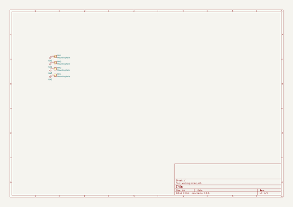

# OOMP Project  
## fan-vent-blocker  by ai03-2725  
  
(snippet of original readme)  
  
- fan-vent-blocker  
Fan vent blockers for PC cases made of PCB material  
  
  
  
Necessary hardware:    
* M4 size screws + hex nuts or similar  
  
Easy production:  
* Take the `Gerber.zip` file from the fan vent blocker size/Gerber directory  
* Upload it to JLCPCB, choose the color of your preference  
* Pay and produce  
  
Customize:  
* Open the source with KiCad  
* Modify in any way  
* Output a new set of gerbers and produce  
  full source readme at [readme_src.md](readme_src.md)  
  
source repo at: [https://github.com/ai03-2725/fan-vent-blocker](https://github.com/ai03-2725/fan-vent-blocker)  
## Board  
  
  
## Schematic  
  
  
  
[schematic pdf](working_schematic.pdf)  
## Images  
  
  
  
  
