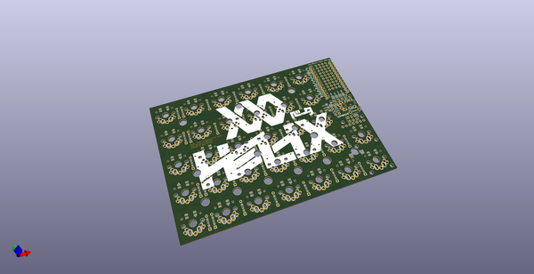
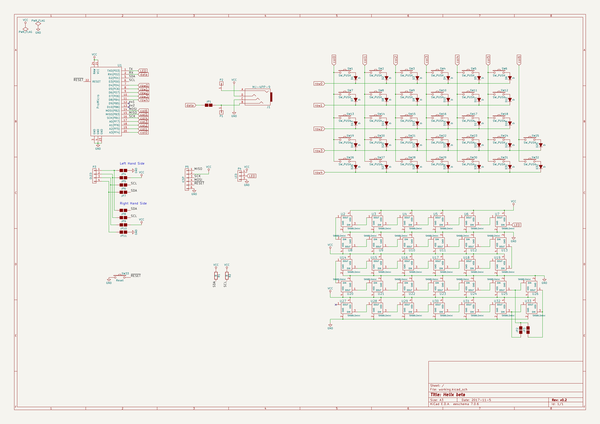
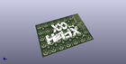

# OOMP Project  
## helix  by ai03-2725  
  
oomp key: oomp_projects_flat_ai03_2725_helix  
(snippet of original readme)  
  
- Helix  
  
  
  
A compact split ortholinear keyboard.  
  
-- Documents  
  
* [Build Guide (JP)](/Doc/buildguide_jp.md)  
* [Firmware (JP)](/Doc/firmware_jp.md)  
* [Usage (JP)](/Doc/usage_jp.md)  
  
  
-- Tool & Data  
  
* [PCB Data](/PCB)  
* [Case Data](/Case)  
* [Font Converter](/FontConverter)  
  
  full source readme at [readme_src.md](readme_src.md)  
  
source repo at: [https://github.com/ai03-2725/helix](https://github.com/ai03-2725/helix)  
## Board  
  
  
## Schematic  
  
  
  
[schematic pdf](working_schematic.pdf)  
## Images  
  
  
  
  
  
  
