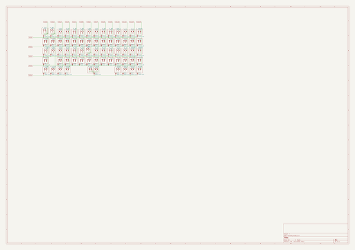

# OOMP Project  
## JP60  by ai03-2725  
  
oomp key: oomp_projects_flat_ai03_2725_jp60  
(snippet of original readme)  
  
- JP60    
GH60互換疑似JISキーボードPCB    
GH60-compatible JIS-like hotswap keyboard PCB  
  
  
    
  
Features    
- MITライセンスのもとでソース公開 / Open-source under the MIT license    
- Kailh製ソケットで全キーホットスワップ可能、はんだ付け無しで組み立て可能 / Fully hotswap    
- GH60対応の60％ケースで使用可能 / Compatible with GH60 standard cases    
- 一般的なキーサイズのみの日本語入力配列なので、GMKやePBTなどの標準キーキャップセットを使用可能 / Features a JIS-like key layout using standard keycap sizes     
  
[配列データ / Layout data](http://www.keyboard-layout-editor.com/-/gists/8acf5e6dbc672aa6a96d8ddba1245e7f)    
    
  full source readme at [readme_src.md](readme_src.md)  
  
source repo at: [https://github.com/ai03-2725/JP60](https://github.com/ai03-2725/JP60)  
## Board  
  
  
## Schematic  
  
  
  
[schematic pdf](working_schematic.pdf)  
## Images  
  
  
  
  
  
  
