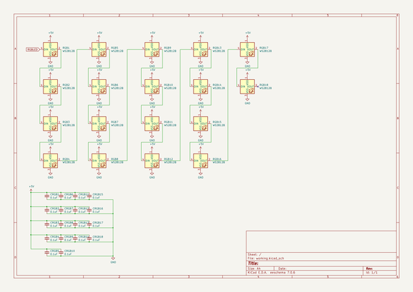

# OOMP Project  
## KBD8X-MKII-PCB  by ai03-2725  
  
(snippet of original readme)  
  
- KBD8X-MKII-PCB  
This is the source for the PCB used in the [KBD8X MKII by KBDfans](https://kbdfans.com/collections/kbd8x-mkii/products/coming-soon-kbd8x-mkii-custom-mechanical-keyboard-kit).    
  
Please verify the conditions of the [license](https://github.com/ai03-2725/KBD8X-MKII-PCB/blob/master/LICENSE) before using.  
  
  
  full source readme at [readme_src.md](readme_src.md)  
  
source repo at: [https://github.com/ai03-2725/KBD8X-MKII-PCB](https://github.com/ai03-2725/KBD8X-MKII-PCB)  
## Board  
  
  
## Schematic  
  
  
  
[schematic pdf](working_schematic.pdf)  
## Images  
  
  
  
  
  
  
