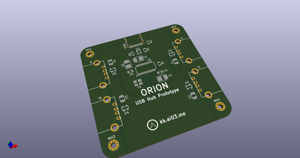
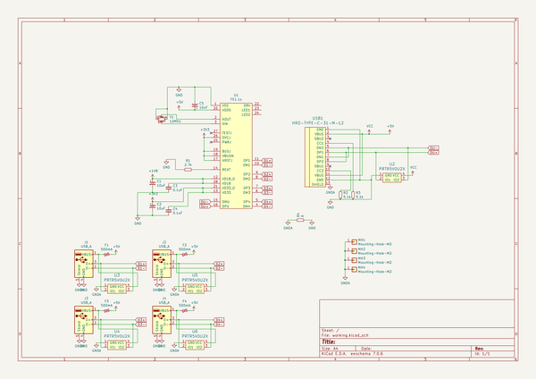
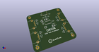
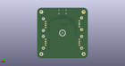
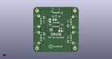

# OOMP Project  
## Orion  by ai03-2725  
  
oomp key: oomp_projects_flat_ai03_2725_orion  
(snippet of original readme)  
  
- Orion  
A prototype USB hub  
  
  
  
--- Warnings  
* I am not an electrical engineer. This is all based on Google knowledge.  
* The USB traces are only 6mil wide. Please verify that your PCB factory is capable of producing such thin traces.  
  
--- Features  
* Just a USB Hub  
* 4x downstream facing USB-A ports  
* Upstream facing USB-C port  
* ESD protection IC on every port  
* Fuse on all downstream facing ports  
* M2 mounting holes  
  full source readme at [readme_src.md](readme_src.md)  
  
source repo at: [https://github.com/ai03-2725/Orion](https://github.com/ai03-2725/Orion)  
## Board  
  
  
## Schematic  
  
  
  
[schematic pdf](working_schematic.pdf)  
## Images  
  
  
  
  
  
  
