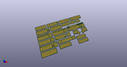
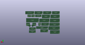
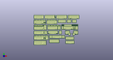

# OOMP Project  
## PCB-Keychains  by ai03-2725  
  
oomp key: oomp_projects_flat_ai03_2725_pcb_keychains  
(snippet of original readme)  
  
- Keyboard PCB Keychains  
Minature keyboards made of PCB material  
  
--- Uses  
- Meetup giveaway freebies  
- Decoration for personal possessions  
  
--- Production  
- Using the given files as-is is NOT recommended.  
- It is recommended to replace the generic labels on the backside of the keychains with labels related to the occasion of production.  
- Remove unnecessary designs as necessary, and recombine.  
  
  full source readme at [readme_src.md](readme_src.md)  
  
source repo at: [https://github.com/ai03-2725/PCB-Keychains](https://github.com/ai03-2725/PCB-Keychains)  
## Board  
  
  
## Schematic  
  
  
  
[schematic pdf](working_schematic.pdf)  
## Images  
  
  
  
  
  
  
