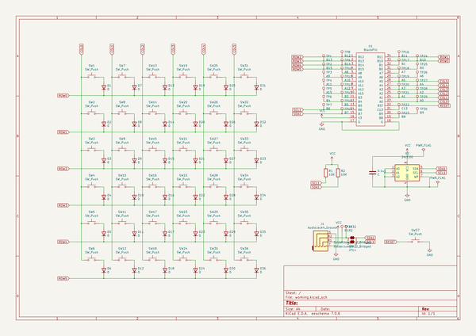
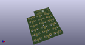
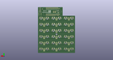
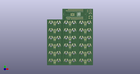

# OOMP Project  
## pillcase36  by ai03-2725  
  
(snippet of original readme)  
  
  
  
A Development Keyboard for ARM Firmware with Blackpill STM32F103  
  
- Features  
 - 6 x 6 ortholinear  
 - Blackpill STM32F103  
 - TRRS Jack  
 - External EEPROM  
 - Many Test pin (I/O, I2C, UART)  
  
- More Information  
See Self-Made Keyboards in Japan Discord Server  
  full source readme at [readme_src.md](readme_src.md)  
  
source repo at: [https://github.com/ai03-2725/pillcase36](https://github.com/ai03-2725/pillcase36)  
## Board  
  
  
## Schematic  
  
  
  
[schematic pdf](working_schematic.pdf)  
## Images  
  
  
  
  
  
  
