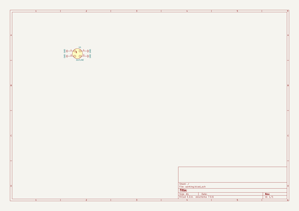

# OOMP Project  
## Pluto  by ai03-2725  
  
oomp key: oomp_projects_flat_ai03_2725_pluto  
(snippet of original readme)  
  
- Pluto  
Cut-PCB MX switch modding plate  
  
  full source readme at [readme_src.md](readme_src.md)  
  
source repo at: [https://github.com/ai03-2725/Pluto](https://github.com/ai03-2725/Pluto)  
## Board  
  
  
## Schematic  
  
  
  
[schematic pdf](working_schematic.pdf)  
## Images  
  
  
  
  
  
  
