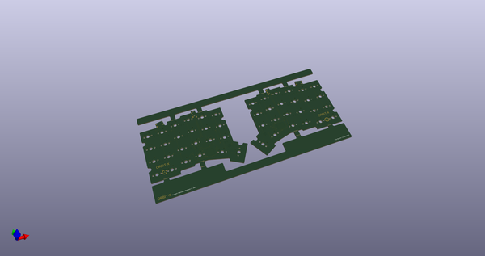
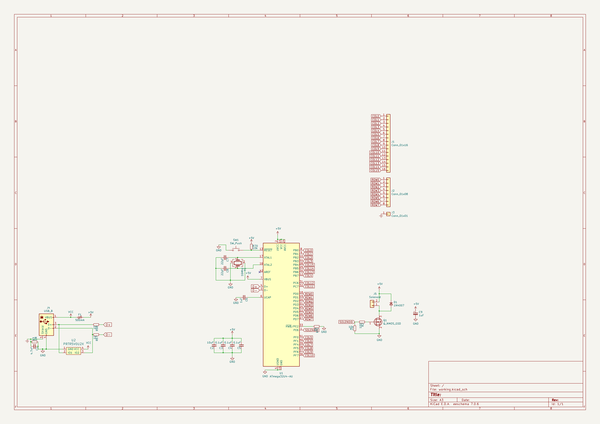
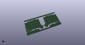
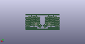
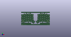

# OOMP Project  
## Quasar  by ai03-2725  
  
oomp key: oomp_projects_flat_ai03_2725_quasar  
(snippet of original readme)  
  
- Quasar  
A replacement controller for the IBM Model M Space Saving keyboard  
  
---- In light of recent claims that I am 100% liable for any of my open source PCBs, I am adding this disclaimer.  
---- I provide these PCBs as a reference for designing keyboard PCBs. Using them within your projects will require a will to do research of one's own and to learn the workings of them, potentially fixing issues if they exist.  
- I provide these PCBs without liability and without any guarantees regarding functionality, as expressed in the MIT license under which all of these PCBs are licensed.  
  
  
  
--- Features   
* ATmega32u4-based  
* USB-B  
  
--- Credits  
* Antonizoon's [Model M USB controller research](https://github.com/antonizoon/antonizoon.github.io/wiki/IBM-Model-M-USB-Controller)  
* Phosphorglow's [SSK matrix reverse engineering](https://deskthority.net/viewtopic.php?t=8149)  
* 9595's [Model M controller dimensions](http://ps-2.kev009.com/ohlandl/keyboard/Keyboard.html)  
* Lmorchard's [Model M USB controller research](http://blog.lmorchard.com/2016/02/21/modelm-controller/-secrets-of-2kro-matrices)  
  full source readme at [readme_src.md](readme_src.md)  
  
source repo at: [https://github.com/ai03-2725/Quasar](https://github.com/ai03-2725/Quasar)  
## Board  
  
  
## Schematic  
  
  
  
[schematic pdf](working_schematic.pdf)  
## Images  
  
  
  
  
  
  
