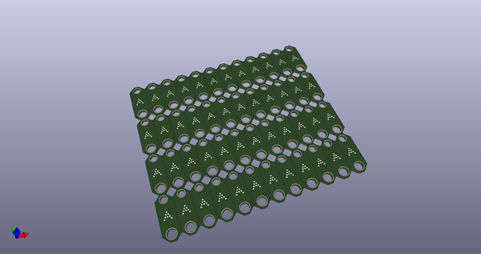
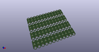
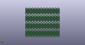
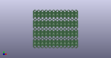

# OOMP Project  
## StabilizerShims  by ai03-2725  
  
oomp key: oomp_projects_flat_ai03_2725_stabilizershims  
(snippet of original readme)  
  
- StabilizerShims  
  
These shims allow for firmly seating PCB-mount Cherry MX stabilizers on thinner-than-spec PCBs.    
  
--- Production info  
* Thickness: 0.4 or 0.6mm for 1.2mm main PCB  
* V-Cut specified on Margin layer  
  
--- Compatibility  
* Cherry clip-in and GMK screw-in stabilizers benefit noticeably   
* ePBT, Durock, Everglide, C3 stabilizers may or may not fit depending on the main PCB  
  
  full source readme at [readme_src.md](readme_src.md)  
  
source repo at: [https://github.com/ai03-2725/StabilizerShims](https://github.com/ai03-2725/StabilizerShims)  
## Board  
  
  
## Schematic  
  
  
  
[schematic pdf](working_schematic.pdf)  
## Images  
  
  
  
  
  
  
