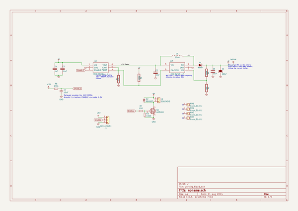
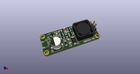
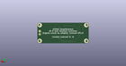
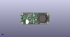

# OOMP Project  
## unified-s9-solenoid-controller  by ai03-2725  
  
(snippet of original readme)  
  
-- **Unified-S9 9V Solenoid Driver**  
  
  
  
**Note:** Prototype not confirmed functional. Please modify to function before producing.  
  
Based on [Xwhatit's work](https://geekhack.org/index.php?topic=58192), modified to work natively through QMK's haptic feedback/solenoid implementation.    
Open-source and extremely compacted to be easily implementable by custom keyboard designers.    
  
All credits for the original circuitry goes to Xwhatsit (source viewable [here](https://github.com/BASLQC/xwhatits-capsense-controller)).    
Many credits to Gondolindrim and Wilba for assistance along the way.  
  
For the rest of the unified daughterboard series, see [here](https://github.com/ai03-2725/Unified-Daughterboard).  
  
  full source readme at [readme_src.md](readme_src.md)  
  
source repo at: [https://github.com/ai03-2725/unified-s9-solenoid-controller](https://github.com/ai03-2725/unified-s9-solenoid-controller)  
## Board  
  
  
## Schematic  
  
  
  
[schematic pdf](working_schematic.pdf)  
## Images  
  
  
  
  
  
  
