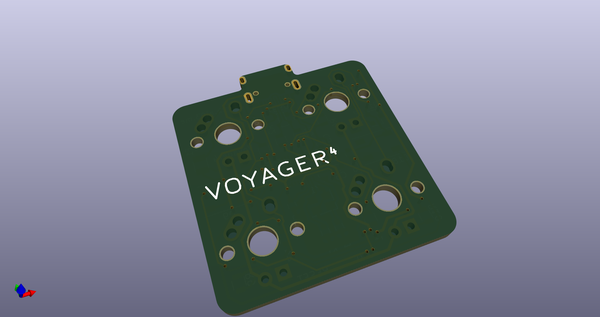
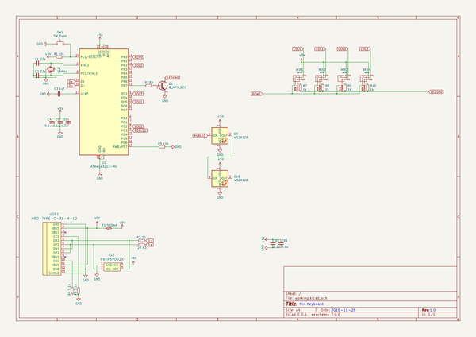
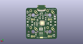
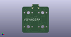

# OOMP Project  
## Voyager4  by ai03-2725  
  
oomp key: oomp_projects_flat_ai03_2725_voyager4  
(snippet of original readme)  
  
- Voyager4  
A tiny, fully featured 4-key macropad PCB  
  
  
  
---- In light of recent claims that I am 100% liable for any of my open source PCBs, I am adding this disclaimer.  
---- I provide these PCBs as a reference for designing keyboard PCBs. Using them within your projects will require a will to do research of one's own and to learn the workings of them, potentially fixing issues if they exist.  
- I provide these PCBs without liability and without any guarantees regarding functionality, as expressed in the MIT license under which all of these PCBs are licensed.  
  
--- Features  
* In-switch LED backlighting  
* RGB underglow  
* Over-current and static discharge protection  
* Fully open-source  
* Absolutely tiny  
  
--- The Voyager PCB Family  
The Voyager PCBs offer fully featured PCBs fit for any keyboard, whether mass production or high-end.  
  
  full source readme at [readme_src.md](readme_src.md)  
  
source repo at: [https://github.com/ai03-2725/Voyager4](https://github.com/ai03-2725/Voyager4)  
## Board  
  
  
## Schematic  
  
  
  
[schematic pdf](working_schematic.pdf)  
## Images  
  
  
  
  
  
  
