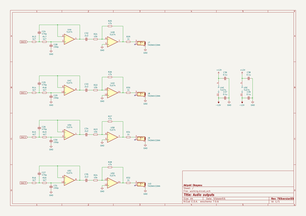
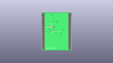
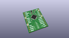
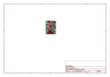
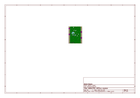
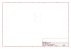
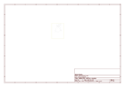
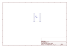
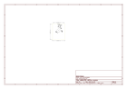

# OOMP Project  
## ADAU1701-RPPico-module  by AkiyukiOkayasu  
  
oomp key: oomp_projects_flat_akiyukiokayasu_adau1701_rppico_module  
(snippet of original readme)  
  
- KiBot CI/CD template repository  
  
This repository provides a ready-to-go CI/CD workflow for KiCad with GitHub actions.  
  
-- Features of this repository template  
  
1. Integration with GitHub releases to automatically produce documentation and  
   fabrication files on every GitHub release, including automatic date and version  
   stamping of schematics and PCBs.  
2. KiBot preflighting on every pull request (ERC/DRC checks disabled by default).  
3. VSCode dev container and default build task for easy local testing of KiBot scripts.  
  
-- Creating your GitHub repo and KiCad project  
  
To create a KiCad project using this GitHub template:  
  
1. Hit the _Use this template_ button then follow the steps from GitHub to create a copy of the repo. **The repository name must exactly match the name of the KiCad project.  
   Do not use spaces in either the repository or the project name.**  
2. Clone the new repo locally.  
3. Go to _File_ > _New_ > _Project..._ in KiCad.  
4. Name the project the exact same name as the GitHub repository name.  
5. Uncheck the _Create a new directory for this project_ option. **This is very important!**  
6. Save the project into the top level of the folder for the GitHub repository.  
  
Do not use spaces in the GitHub repository or KiCad project name. Use underscores or hyphens instead, for example `TBM930_De-Ice_-_Panel` or `Collins-FMS-3000`.  
  
If you've done all the steps correctly the folder structure will look similar like this:  
  
  
  
source repo at: [https://github.com/AkiyukiOkayasu/ADAU1701-RPPico-module](https://github.com/AkiyukiOkayasu/ADAU1701-RPPico-module)  
## Board  
  
  
## Schematic  
  
  
  
[schematic pdf](working_schematic.pdf)  
## Images  
  
  
  
  
  
  
  
  
  
  
  
  
  
  
  
  
  
  
  
  
  
  
