# OOMP Project  
## BreadBoardSynthDevelopmentUtilities  by AkiyukiOkayasu  
  
oomp key: oomp_projects_flat_akiyukiokayasu_breadboardsynthdevelopmentutilities  
(snippet of original readme)  
  
- BreadBoardSynthDevelopmentUtilities    
[ブレッドボード　６穴版　ＥＩＣ－３９０１](https://akizukidenshi.com/catalog/g/gP-12366/)  
  
-- Eurorack power    
  
Pull the Eurorack's power bus cable out to the BreadBoard's power rail.    
Only split power lines in the middle can be used.    
  
  
-- Pod  
  
  
  
- PJ302  
  
  
  
  full source readme at [readme_src.md](readme_src.md)  
  
source repo at: [https://github.com/AkiyukiOkayasu/BreadBoardSynthDevelopmentUtilities](https://github.com/AkiyukiOkayasu/BreadBoardSynthDevelopmentUtilities)  
## Board  
  
  
## Schematic  
  
[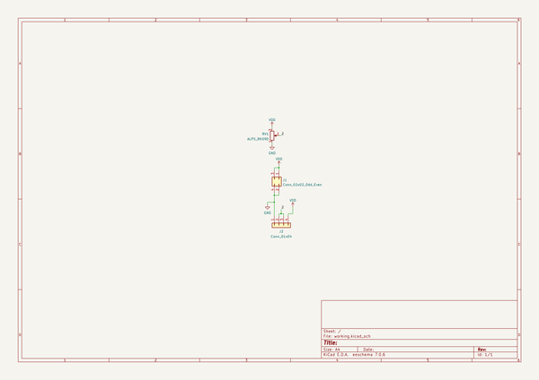](working_schematic.png)  
  
[schematic pdf](working_schematic.pdf)  
## Images  
  
[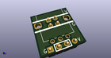](working_3d.png)  
  
[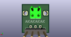](working_3d_back.png)  
  
[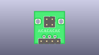](working_3D_bottom.png)  
  
[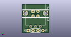](working_3d_front.png)  
  
[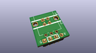](working_3D_top.png)  
  
[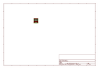](working_assembly_page_01.png)  
  
[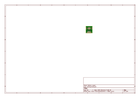](working_assembly_page_02.png)  
  
[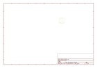](working_assembly_page_03.png)  
  
[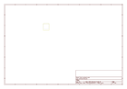](working_assembly_page_04.png)  
  
[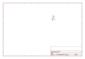](working_assembly_page_05.png)  
  
[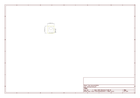](working_assembly_page_06.png)  
