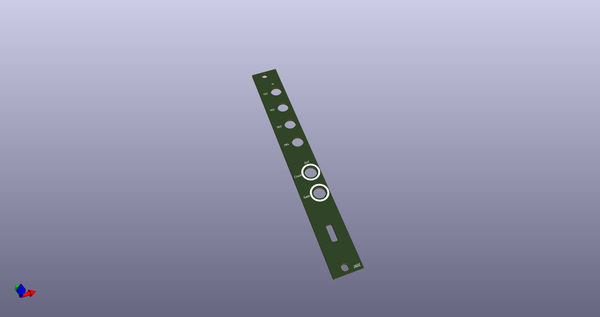
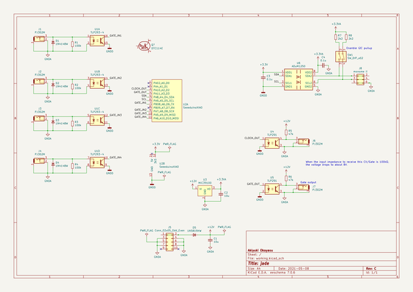
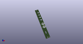
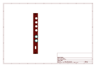
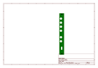
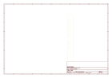
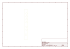

# OOMP Project  
## jade  by AkiyukiOkayasu  
  
(snippet of original readme)  
  
- jade  
  
USB-MIDI to monome ii converter.    
Use MIDI SysEx to communicate with monome ii.    
It should be noted that this project is in its early stages.    
  
-- Eurorack module  
  
  
  
-- Firmware  
  
--- Dependencies  
  
- PlatformIO  
  
-- Max for Live  
  
Max for Live devices for Just Friends are available.    
Max for Live devices for ER-301 will be added soon.    
  
  
-- Document  
  
[document](https://akiyukiokayasu.github.io/jade/)  
  
-- Data format  
  
The SysEx specification for communicating with Jade will be documented in the future.    
SysEx can only send values between 0 and 127. Therefore, 1 byte (0~255) of monome ii is divided into 2 bytes and sent.    
Like this.    
  
Original data (1byte):: |ABCDEFGH|    
Divide data (2bytes):: |0000ABCD| |0000EFGH|    
  
-- LICENSE    
  
MIT    
  
  full source readme at [readme_src.md](readme_src.md)  
  
source repo at: [https://github.com/AkiyukiOkayasu/jade](https://github.com/AkiyukiOkayasu/jade)  
## Board  
  
  
## Schematic  
  
  
  
[schematic pdf](working_schematic.pdf)  
## Images  
  
  
  
  
  
  
  
  
  
  
  
  
  
  
  
  
  
  
  
  
  
  
