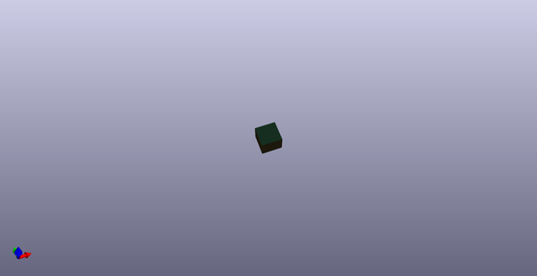
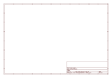
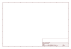

# OOMP Project  
## KiCad-PCB-Template  by AkiyukiOkayasu  
  
(snippet of original readme)  
  
- KiCad-PCB-Template  
  
KiCad template projects applying each board manufacturer's design rules.    
  
-- How to use  
  
"Import Settings from Another Board..." to import design rules.  
  
  
  full source readme at [readme_src.md](readme_src.md)  
  
source repo at: [https://github.com/AkiyukiOkayasu/KiCad-PCB-Template](https://github.com/AkiyukiOkayasu/KiCad-PCB-Template)  
## Board  
  
  
## Schematic  
  
  
  
[schematic pdf](working_schematic.pdf)  
## Images  
  
  
  
  
  
  
  
  
  
  
  
  
  
  
  
  
  
  
  
  
  
  
