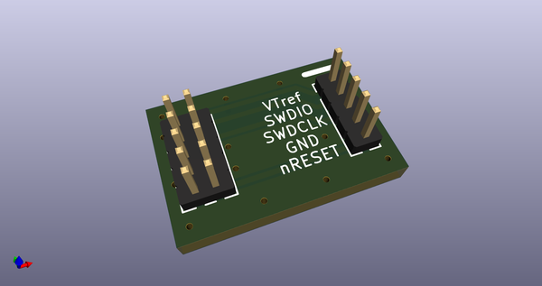
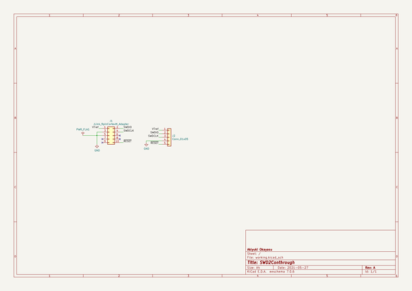
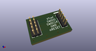
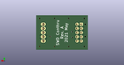
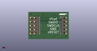

# OOMP Project  
## SWD2Conthrough  by AkiyukiOkayasu  
  
(snippet of original readme)  
  
- SWD2Conthrough  
  
Jig to convert the J-Link 9pin Cortex-M adapter to a 5pin conthrough.    
  
  
-- About Conthrough  
  
A pin header with spring contact.    
The [XE-1](https://www.mac8sdk.co.jp/products/430) / Mac8 is used.  
  
  full source readme at [readme_src.md](readme_src.md)  
  
source repo at: [https://github.com/AkiyukiOkayasu/SWD2Conthrough](https://github.com/AkiyukiOkayasu/SWD2Conthrough)  
## Board  
  
  
## Schematic  
  
  
  
[schematic pdf](working_schematic.pdf)  
## Images  
  
  
  
  
  
  
