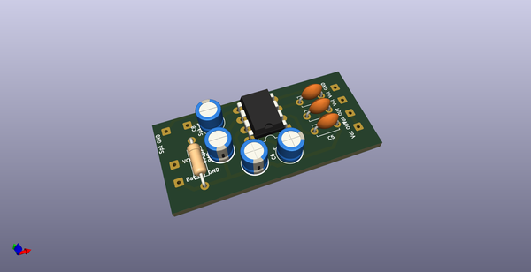
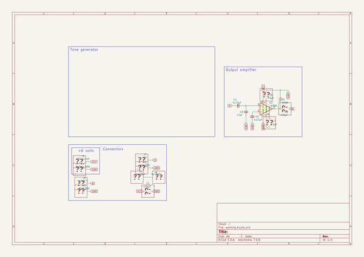
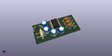
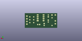
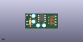

# OOMP Project  
## 1979-MINI-GAN-PET-103  by Alasofia  
  
(snippet of original readme)  
  
- 1979-MINI-GAN-PET-103  
  
PCB and schematics based on Youtube video by [David Hilowitz Music](https://www.youtube.com/watch?v=ADZXv5DA7Ek).  
  
Here you will get PCB layouts based on the original boards and KiCad source files that you can download and customize to your needs.  
  
Please share any updates and improvments!  
  
  
[Visit www.capadiy.com](https://www.capadiy.com)  
  
Instagram: [@CapaDIY](https://www.instagram.com/CapaDIY)  
  
Patreon: [https://www.patreon.com/CapaDIY](https://www.patreon.com/CapaDIY)  
  
  full source readme at [readme_src.md](readme_src.md)  
  
source repo at: [https://github.com/Alasofia/1979-MINI-GAN-PET-103](https://github.com/Alasofia/1979-MINI-GAN-PET-103)  
## Board  
  
  
## Schematic  
  
  
  
[schematic pdf](working_schematic.pdf)  
## Images  
  
  
  
  
  
  
