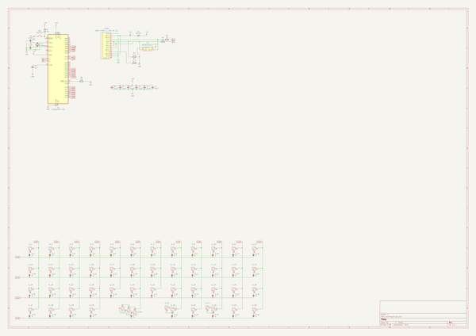

# OOMP Project  
## model-v  by Alasofia  
  
(snippet of original readme)  
  
- model-v  
  
Info here  
https://trashman.wiki/en/community/pcbs/model-v  
  
  
  
  full source readme at [readme_src.md](readme_src.md)  
  
source repo at: [https://github.com/Alasofia/model-v](https://github.com/Alasofia/model-v)  
## Board  
  
  
## Schematic  
  
  
  
[schematic pdf](working_schematic.pdf)  
## Images  
  
  
  
  
