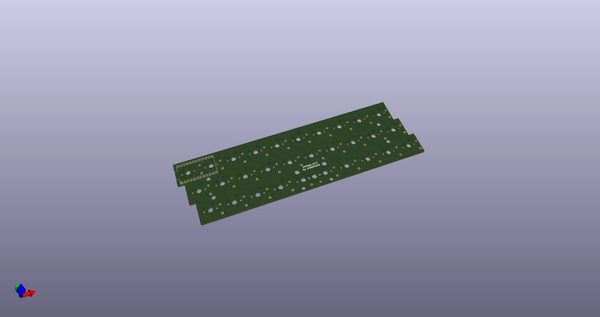
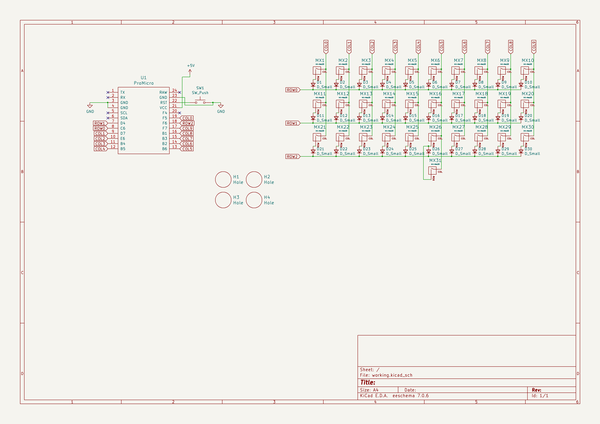
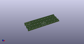
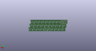
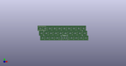

# OOMP Project  
## omega  by Alasofia  
  
oomp key: oomp_projects_flat_alasofia_omega  
(snippet of original readme)  
  
- Omega  
  
Hot swap  
  
  
Solder  
  
  
Omega4  
  
  
The omega is a hot swap 30%(30 or 29 keys depending on the layout you choose) inspired by the [Zlant](https://www.reddit.com/r/MechanicalKeyboards/search?q=zlant&restrict_sr=1) and the [Alpha 28](https://geekhack.org/index.php?topic=99040.0) keyboards.    
The omeaga4 adds a 4th with a few options to make this more than a novelty piece.  
  
The plate files, stls for 3D printing, and STEP files can be found in the [docs](./docs) folder.    
There are also gerbers already generated in the gerber folders.  
  
    
  
  
  full source readme at [readme_src.md](readme_src.md)  
  
source repo at: [https://github.com/Alasofia/omega](https://github.com/Alasofia/omega)  
## Board  
  
  
## Schematic  
  
  
  
[schematic pdf](working_schematic.pdf)  
## Images  
  
  
  
  
  
  
