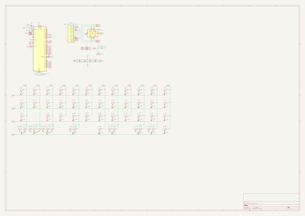

# OOMP Project  
## semi  by Alasofia  
  
(snippet of original readme)  
  
- semi  
 A 12.25u experiment  
  
   
   
   
  
  full source readme at [readme_src.md](readme_src.md)  
  
source repo at: [https://github.com/Alasofia/semi](https://github.com/Alasofia/semi)  
## Board  
  
  
## Schematic  
  
  
  
[schematic pdf](working_schematic.pdf)  
## Images  
  
  
  
  
  
  
