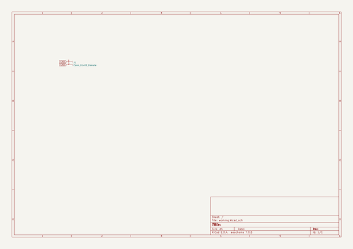

# OOMP Project  
## Squid60  by Alasofia  
  
(snippet of original readme)  
  
- Squid60  
GH60 Compatible PCB using Hi-Tek 725 Series (Space Invaders) switches.  
  
Supports 8255C+/RT101 layouts.  
  
Thanks to Engicoder and ai03 for the footprints and PCB design guide.  
  
- Pictures  
  
  
  
  
  
This work is licensed under the Creative Commons Attribution-NonCommercial 4.0 International License.  
  
  full source readme at [readme_src.md](readme_src.md)  
  
source repo at: [https://github.com/Alasofia/Squid60](https://github.com/Alasofia/Squid60)  
## Board  
  
  
## Schematic  
  
  
  
[schematic pdf](working_schematic.pdf)  
## Images  
  
  
  
  
  
  
