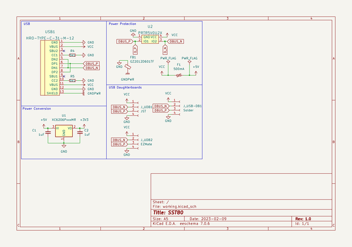
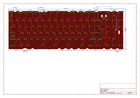
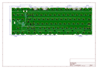
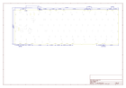
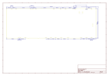
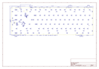
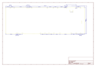

# OOMP Project  
## SST80  by Alasofia  
  
(snippet of original readme)  
  
- SST80  
  
-- Fully open source multi-layout 80% (TKL) PCB  
  
-- Layout support  
  
  
-- Features  
- RGB Underglow  
- RP2040 processor  
- MX and Alps compatible  
- Indicator light positions for Caps Lock, Esc and Scroll Lock  
- Universal TKL PCB support (H87C, H88C, Apollo etc. North facing spacebar)  
- USB-C or Unified Daughterboard (or equivalent with the same pinout.)  
- Overcurrent and ESD protection  
  
-- ***DISCLAIMER***  
This PCB has been tested and confirmed to work properly. The members of the PCB development team are not liable if you end up with a non-functional pcb. Order at your own risk. Support will not be provided but pull requests will be reviewed and possibly accepted. RGB matrix firmware has not yet been written.  
  
  full source readme at [readme_src.md](readme_src.md)  
  
source repo at: [https://github.com/Alasofia/SST80](https://github.com/Alasofia/SST80)  
## Board  
  
  
## Schematic  
  
  
  
[schematic pdf](working_schematic.pdf)  
## Images  
  
  
  
  
  
  
  
  
  
  
  
  
  
  
  
  
  
  
  
  
  
  
