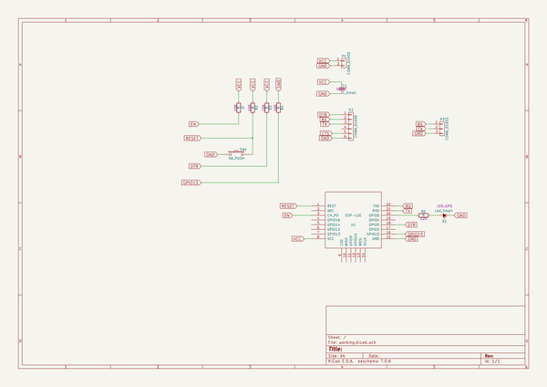

# OOMP Project  
## altESProg  by altLab  
  
oomp key: oomp_projects_flat_altlab_altesprog  
(snippet of original readme)  
  
- ESP8266 11-11-2016  
Respositorio tem como objetivo a programação do chip da Expressif https://espressif.com/en/products designado por: ESP8266-12E, usando o firmware de interface web "ESP Easy" http://www.letscontrolit.com:  
  
The ESP Easy firmware can be used to turn the ESP module into an easy multifunction sensor device for Home Automation solutions like Domoticz. Configuration of the ESP Easy is entirely web based, so once you've got the firmware loaded, you don't need any other tool besides a common web browser.  
  
The ESP Easy firmware is currently at build R78 an looks stable enough for production purposes as long as it's being used as a sensor device.  
  
ESP Easy also offers limited "low level" actuator functions but due to system instability, this could be less useful in real life applications.   
The ESP Easy supports several Home Automation controllers or web-services that collect sensor data.  
  
Ferramentas (Software):  
 - kicad http://kicad-pcb.org/  
 - ESP Easy http://www.letscontrolit.com/wiki/index.php/ESPEasy-Loading_firmware  
   
 Ferramentas (Hardware):  
 - SparkFun FTDI Basic Breakout - 3.3V https://www.sparkfun.com/products/9873  
   
 ESP Easy firmware:  
 - Firmware image R120  
   
 Flashing the module Windows "cmd" console:  
  
Step 1 - Find the right flash size of your module  
Step 2 - Download the zipfile here: Firmware and unpack to a folder of choice.  
Step 3 - Double Click "flash.cmd". A command windows should start with three questions.  
Step 4 - Select the com port that your  
  full source readme at [readme_src.md](readme_src.md)  
  
source repo at: [https://github.com/altLab/altESProg](https://github.com/altLab/altESProg)  
## Board  
  
  
## Schematic  
  
  
  
[schematic pdf](working_schematic.pdf)  
## Images  
  
  
  
  
  
  
