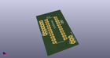
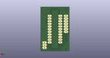
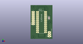

# OOMP Project  
## AltoEspectro  by altLab  
  
(snippet of original readme)  
  
- AltoEspectro  
  
Projecto de Uma Camara de CCD arrefecida para Espectroscopia, imagem de scanning, ou para fotografia panorâmica se utilizada com cabeça panorâmica.  
  
Assenta no Sensor CCD da Sony ILX 544A com ultra sensibilidade.  
  
Tendo como unidade de génese de sinais, leitura da saída do sensor, controlo do arrefecimento termoeléctrico, e controlo de temperatura o Microcontrolador da Atmel Atmega 328 que faz parte do Arduino Nano.  
  
Notas do projecto podem ser encontradas no MicroSite de Documentação do AltLab   
  
[aqui](http://altlab.org/d/s/projectos/altspectra/)  
  
Projecto Iniciado por:  
  
- Fernando Carvalho  
- JAC  
- Luis Dinis  
- Pedro Angelo  
  
  full source readme at [readme_src.md](readme_src.md)  
  
source repo at: [https://github.com/altLab/AltoEspectro](https://github.com/altLab/AltoEspectro)  
## Board  
  
  
## Schematic  
  
  
  
[schematic pdf](working_schematic.pdf)  
## Images  
  
  
  
  
  
  
