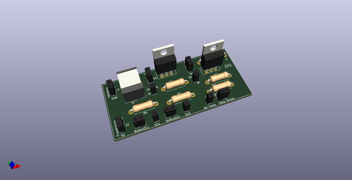
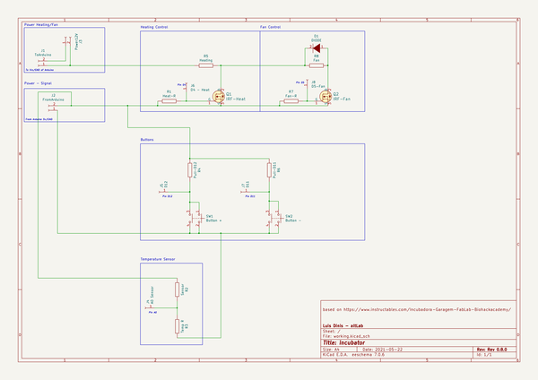
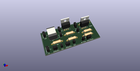
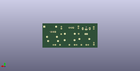
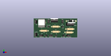

# OOMP Project  
## biolab-incubator  by altLab  
  
oomp key: oomp_projects_flat_altlab_biolab_incubator  
(snippet of original readme)  
  
Kicad Drawings for an incubator based on  
  
https://www.instructables.com/Incubadora-Garagem-FabLab-Biohackacademy/  
  
- Information  
  
The kicad drawings don't have real footprint assignment, they are first proposal with real components, but never have been fabricated  
  
They are only for rendering purposes  
  
Consider it a **WIP** stage  
  
- Version 1.0  
  
  
  
  full source readme at [readme_src.md](readme_src.md)  
  
source repo at: [https://github.com/altLab/biolab-incubator](https://github.com/altLab/biolab-incubator)  
## Board  
  
  
## Schematic  
  
  
  
[schematic pdf](working_schematic.pdf)  
## Images  
  
  
  
  
  
  
