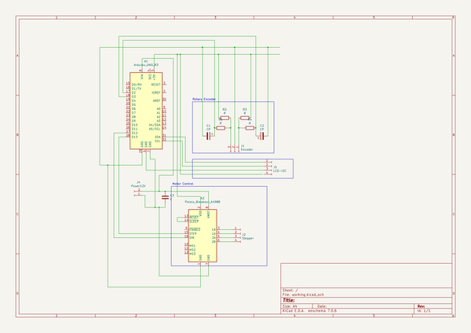

# OOMP Project  
## biolab-peristaltic-pump  by altLab  
  
(snippet of original readme)  
  
- biolab-peristaltic-pump  
  
-- Based on  
  
FabLab Lisboa Biolab Workshop  
  
- Warning  
  
this is a WorkInProgress, footprint assignment are only a draft and for "rendering" purposes  
  
When the first PCB is made and confirmed it works with components I will tag it and update it  
  
- Version 01.00  
  
  
  
  
  
  full source readme at [readme_src.md](readme_src.md)  
  
source repo at: [https://github.com/altLab/biolab-peristaltic-pump](https://github.com/altLab/biolab-peristaltic-pump)  
## Board  
  
  
## Schematic  
  
  
  
[schematic pdf](working_schematic.pdf)  
## Images  
  
  
  
  
  
  
