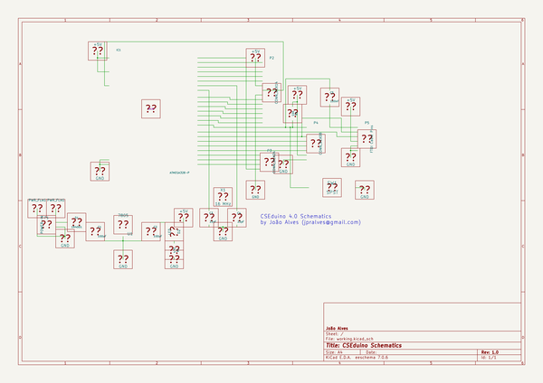

# OOMP Project  
## HardwareBlocks_CSEduino  by altLab  
  
oomp key: oomp_projects_flat_altlab_hardwareblocks_cseduino  
(snippet of original readme)  
  
- CSEduino  
  
Build your Arduino from scratch - projects  
  
See more info at http://jpralves.net/cseduino/  
  
This tree is organized in the following way:  
  
- [projects](projects) - projects created with CSEDuino board  
- [boards](boards) - Designs of PCB boards for CSEduino v3 and v4 (Kicad Format)  
- [workshop](workshop) - Exercises for Workshops  
  
-- The V3 Board:  
  
Board with components:  
  
  
  
-- The v4 Board:  
  
Board with components:  
  
  
  
Front of the board:  
  
  
  
Back of the board:  
  
  
  
  
  
  full source readme at [readme_src.md](readme_src.md)  
  
source repo at: [https://github.com/altLab/HardwareBlocks_CSEduino](https://github.com/altLab/HardwareBlocks_CSEduino)  
## Board  
  
  
## Schematic  
  
  
  
[schematic pdf](working_schematic.pdf)  
## Images  
  
  
  
  
  
  
