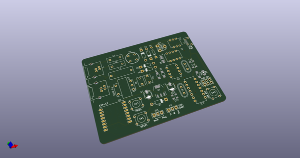
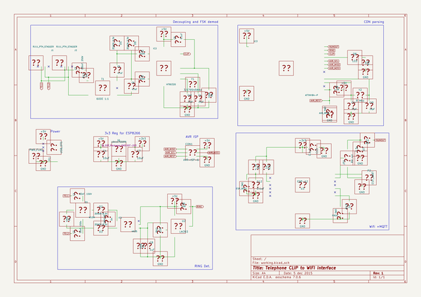
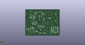
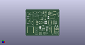

# OOMP Project  
## wifi_pstn_cid  by aniline  
  
oomp key: oomp_projects_flat_aniline_wifi_pstn_cid  
(snippet of original readme)  
  
- WiFi PSTN Caller ID  
  
PSTN Caller ID to WiFi interface. This hooks up a Belcore FSK decoder  
to an AVR microcontroller (ATTiny84) and a ESP8266 module so one can parse the caller-id   
message from the local office and trasnmit the info over wifi.  
  
-- Firmware  
  
Available at [aniline/wifi_pstn_cid_fw](https://github.com/aniline/wifi_pstn_cid_fw)  
  
  full source readme at [readme_src.md](readme_src.md)  
  
source repo at: [https://github.com/aniline/wifi_pstn_cid](https://github.com/aniline/wifi_pstn_cid)  
## Board  
  
  
## Schematic  
  
  
  
[schematic pdf](working_schematic.pdf)  
## Images  
  
  
  
  
  
  
