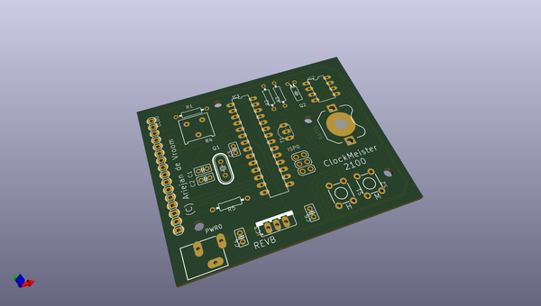
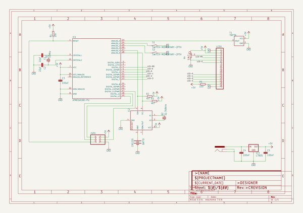

# OOMP Project  
## ClockMeister2100-Schematics  by ariejan  
  
(snippet of original readme)  
  
- ClockMeister 2100 Schematics  
  
Schematics and PCB Layout in Eagle format for the ClockMeister 2100 project.  
  
-- About  
  
ClockMeister 2100 is a project to learn PCB design and create something  
with a MCU from scratch. The 2100 keeps the time and measures temperature.   
Both are displayed on a 16x1 LCD Display.  
  
The code for programming the ATMega328P can be found at [github.com/ariejan/ClockMeister2100](https://github.com/ariejan/ClockMeister2100)  
  
-- License  
  
 ClockMeister 2100 by <a xmlns:cc="http://creativecommons.org/ns-" href="https://ariejan.net" property="cc:attributionName" rel="cc:attributionURL">Ariejan de Vroom</a> is licensed under a <a rel="license" href="http://creativecommons.org/licenses/by-nc-sa/4.0/">Creative Commons Attribution-NonCommercial-ShareAlike 4.0 International License</a>.  
  
  full source readme at [readme_src.md](readme_src.md)  
  
source repo at: [https://github.com/ariejan/ClockMeister2100-Schematics](https://github.com/ariejan/ClockMeister2100-Schematics)  
## Board  
  
  
## Schematic  
  
  
  
[schematic pdf](working_schematic.pdf)  
## Images  
