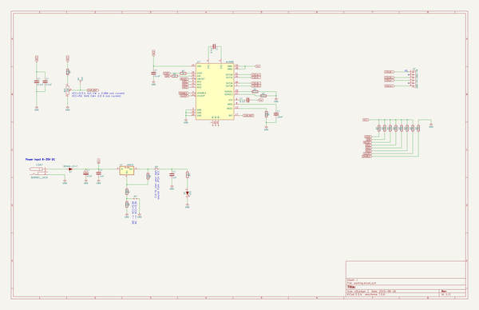

# OOMP Project  
## nema23_driver  by ashtonchase  
  
(snippet of original readme)  
  
- nema23_driver  
PCB that controls a NEMA 23 stepper motor. Mounts to the back of the motor.  
  
  full source readme at [readme_src.md](readme_src.md)  
  
source repo at: [https://github.com/ashtonchase/nema23_driver](https://github.com/ashtonchase/nema23_driver)  
## Board  
  
  
## Schematic  
  
  
  
[schematic pdf](working_schematic.pdf)  
## Images  
  
  
  
  
  
  
