# OOMP Project  
## 5mm08_2p_for_breadboard  by asukiaaa  
  
(snippet of original readme)  
  
- 5mm08_2p_for_breadboard  
  
A breakout board for 5.08mm terminal for breadboard.  
  
-- License  
  
MIT  
  
-- References  
  
- [太い電線をブレッドボードに引き出すためのターミナルブロック変換基板 - 試行錯誤な日々](https://asukiaaa.blogspot.com/2021/11/5mm08-2p-for-breadboard.html)  
- [太い線をブレッドボードに引き込むための変換基板 - スイッチサイエンス](https://www.switch-science.com/catalog/7586/)  
  
  full source readme at [readme_src.md](readme_src.md)  
  
source repo at: [https://github.com/asukiaaa/5mm08_2p_for_breadboard](https://github.com/asukiaaa/5mm08_2p_for_breadboard)  
## Board  
  
[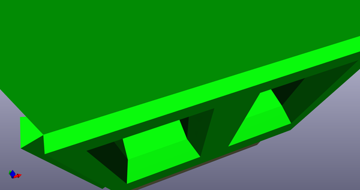](working_3d.png)  
## Schematic  
  
[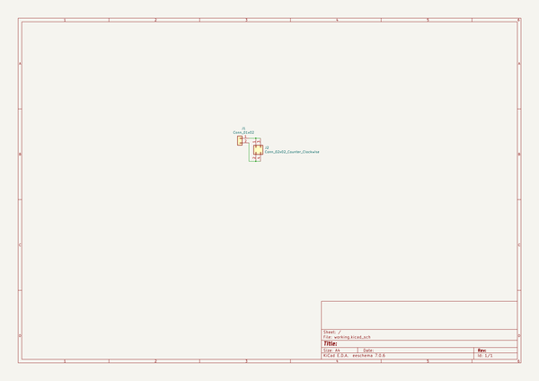](working_schematic.png)  
  
[schematic pdf](working_schematic.pdf)  
## Images  
  
  
  
[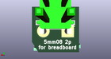](working_3d_back.png)  
  
[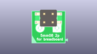](working_3D_bottom.png)  
  
  
  
[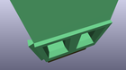](working_3D_top.png)  
  
[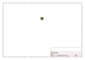](working_assembly_page_01.png)  
  
[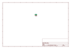](working_assembly_page_02.png)  
  
[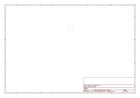](working_assembly_page_03.png)  
  
[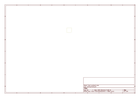](working_assembly_page_04.png)  
  
[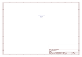](working_assembly_page_05.png)  
  
[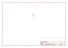](working_assembly_page_06.png)  
