# OOMP Project  
## AD5254Breakout  by asukiaaa  
  
oomp key: oomp_projects_flat_asukiaaa_ad5254breakout  
(snippet of original readme)  
  
- AD5254 Breakout  
  
A breakout board to use AD5254 designed with KiCad.  
  
An Arduino library is here.  
  
[AD5254_asukiaaa](https://github.com/asukiaaa/AD5254_asukiaaa)  
  
-- References  
  
- [ポテンショメーター（I2C通信で制御可能な可変抵抗）AD5254をArduinoで制御してみた](https://asukiaaa.blogspot.com/2020/01/ad5254arduino.html)  
  
  full source readme at [readme_src.md](readme_src.md)  
  
source repo at: [https://github.com/asukiaaa/AD5254Breakout](https://github.com/asukiaaa/AD5254Breakout)  
## Board  
  
[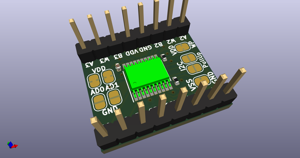](working_3d.png)  
## Schematic  
  
[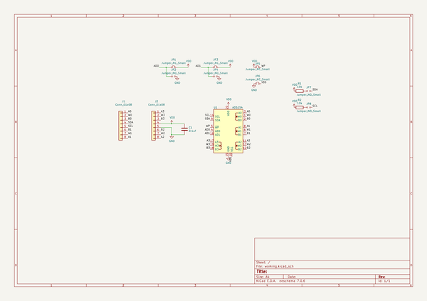](working_schematic.png)  
  
[schematic pdf](working_schematic.pdf)  
## Images  
  
  
  
[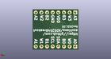](working_3d_back.png)  
  
[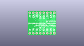](working_3D_bottom.png)  
  
[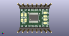](working_3d_front.png)  
  
[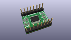](working_3D_top.png)  
  
[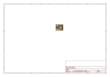](working_assembly_page_01.png)  
  
[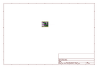](working_assembly_page_02.png)  
  
  
  
[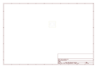](working_assembly_page_04.png)  
  
[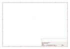](working_assembly_page_05.png)  
  
[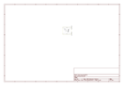](working_assembly_page_06.png)  
