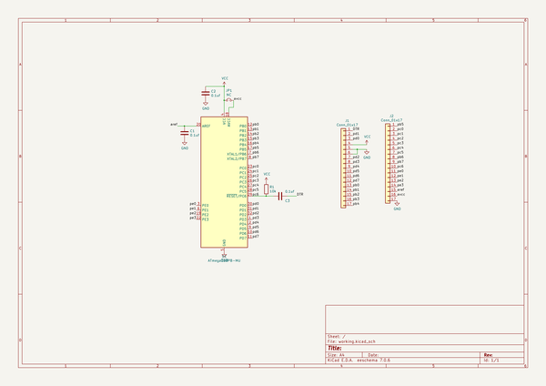
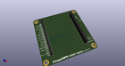
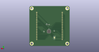
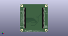

# OOMP Project  
## ATmega328PB-bread-board  by asukiaaa  
  
oomp key: oomp_projects_flat_asukiaaa_atmega328pb_bread_board  
(snippet of original readme)  
  
- ATmega328PB-bread-board  
  
  
  
[schema](/docs/ATmega328PB-bread-board.pdf)  
  
-- License  
  
MIT  
  
-- References  
  
- [ATmega328PB datasheet (PDF)](http://ww1.microchip.com/downloads/en/DeviceDoc/40001906A.pdf)  
- [MiniCore](https://github.com/MCUdude/MiniCore)  
- [MiniCore/avr/variants/pb-variant/pins_arduino.h](https://github.com/MCUdude/MiniCore/blob/master/avr/variants/pb-variant/pins_arduino.h)  
- [ATmega328PBの信号線をミニブレッドボードの横に引き出す基板を作ってみた ](https://asukiaaa.blogspot.com/2020/07/atmega328pb-mini-breadboard-breakout.html)  
  
  full source readme at [readme_src.md](readme_src.md)  
  
source repo at: [https://github.com/asukiaaa/ATmega328PB-bread-board](https://github.com/asukiaaa/ATmega328PB-bread-board)  
## Board  
  
  
## Schematic  
  
  
  
[schematic pdf](working_schematic.pdf)  
## Images  
  
  
  
  
  
  
